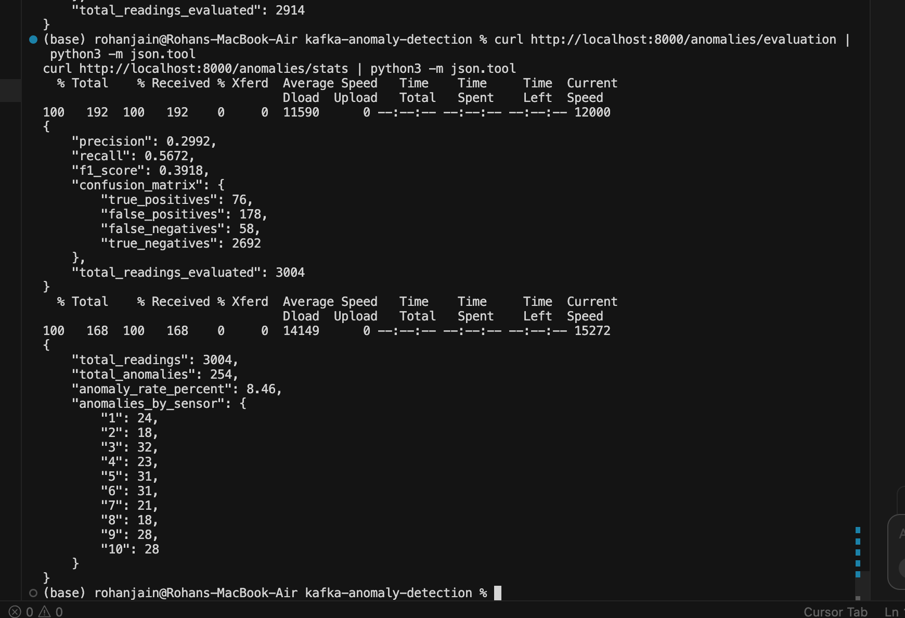

# Kafka Anomaly Detection Pipeline

Real-time anomaly detection on streaming IoT sensor data. A Kafka producer simulates industrial temperature and vibration readings (with ~5% injected anomalies), a consumer scores each message with an unsupervised Isolation Forest model, flagged anomalies are persisted to PostgreSQL, and a FastAPI service exposes query and evaluation endpoints.

## Architecture

```
┌──────────┐     ┌───────┐     ┌──────────────────────────┐     ┌────────────┐     ┌─────────┐
│ Producer │────▶│ Kafka │────▶│ Consumer (Isolation Forest)│────▶│ PostgreSQL │────▶│ FastAPI │
│ (sim)    │     │       │     │ score + persist            │     │            │     │ :8000   │
└──────────┘     └───────┘     └──────────────────────────┘     └────────────┘     └─────────┘
```

## How to Run

Start the full stack:

```bash
docker compose up --build
```

Wait 1–2 minutes for Kafka, PostgreSQL, and the model to initialize. You should see:

- **Producer logs**: readings sent every 2 seconds for 10 sensors, occasionally marked `[INJECTED ANOMALY]`
- **Consumer logs**: each reading scored; `*** ANOMALY DETECTED ***` alerts when the model flags a reading

Verify the API:

```bash
curl http://localhost:8000/health
```

## Simulated Data & Anomaly Injection

Each message contains `sensor_id` (1–10), `timestamp`, `temperature`, `vibration`, and `ground_truth_anomaly`.

| Field | Normal range | Anomaly range |
|-------|-------------|---------------|
| temperature | 60–80 | 95–130 |
| vibration | 0.1–0.5 | 2.0–5.0 |

Anomalies are injected at roughly **5%** probability. When an anomaly is injected, either temperature or vibration (not both) is pushed into the anomalous range. The `ground_truth_anomaly` flag is included in Kafka messages for offline evaluation only — the consumer **never** uses it when scoring.

## Evaluation

The most important endpoint is `/anomalies/evaluation`. It compares the model's predictions (`is_anomaly` in `readings_log`) against the injected `ground_truth_anomaly` labels to compute **precision**, **recall**, and **F1 score**. This proves the unsupervised Isolation Forest actually catches injected anomalies — not just that the pipeline runs.

Let the stack run for **5–10 minutes** before checking evaluation metrics so enough data accumulates for meaningful numbers.

## Results

After ~5 minutes of streaming (3,004 readings processed):

| Metric | Value |
|--------|-------|
| Precision | 0.30 |
| Recall | 0.57 |
| F1 score | 0.39 |
| Injected anomaly rate | ~4.5% |
| Model flag rate | ~8.5% |



The unsupervised Isolation Forest catches **~57% of injected anomalies** (recall). Precision is lower because the model flags ~8.5% of all readings while only ~4.5% are truly anomalous — typical for unsupervised detection without labeled training data.

## API Endpoints

### Health check

```bash
curl http://localhost:8000/health
```

### Recent anomalies

```bash
curl "http://localhost:8000/anomalies/recent?limit=20"
```

### Summary statistics

```bash
curl http://localhost:8000/anomalies/stats
```

### Model evaluation (precision / recall / F1)

```bash
curl http://localhost:8000/anomalies/evaluation
```

Example evaluation response (from a live run):

```json
{
  "precision": 0.2992,
  "recall": 0.5672,
  "f1_score": 0.3918,
  "confusion_matrix": {
    "true_positives": 76,
    "false_positives": 178,
    "false_negatives": 58,
    "true_negatives": 2692
  },
  "total_readings_evaluated": 3004
}
```

## Local-Only — Zero Cost

This project requires **no API keys**, **no `.env` file**, and **no cloud services**. Everything runs locally via Docker Compose: Kafka, Zookeeper, PostgreSQL, producer, consumer, and API.
